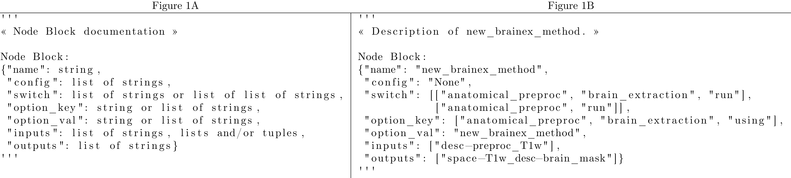

# Title

NodeBlocks: Lowering the Barriers to Building into C-PAC

# Authors and Affiliations

Jon Clucas*, Steve Giavasis*, Gregory Kiar, Michael P. Milham

# Categorical Terms

## Primary

Methods Development

## Secondary

Workflows

# Keywords

# Introduction

Nipype [1] “provides a uniform interface to existing neuroimaging software and facilitates interaction between these packages within a single workflow.” [2] C-PAC leverages Nipype to build and run neuroimaging pipelines, abstracting the configuration to a few command-line instructions (provide `bids_dir` or `--data_config_file` to specify data; provide `--preconfig` or `--pipeline_file` to specify a pipeline) for simple (re)use once a pipeline is designed. C-PAC users don’t need to understand Nipype; they can just specify their configurations.

Developers do need to understand Nipype in order to contribute to C-PAC. That necessary expertise has historically been a barrier to entry for new contributors. We developed C-PAC’s NodeBlock engine [3], to facilitate development, integration, and testing through modularity and abstraction, moving the C-PAC developer experience closer to the C-PAC user experience.

# Methods

C-PAC internally tracks files in a ResourcePool instance (partitioned into isolated “strategy pools”), keyed by each file’s role (e.g., a raw functional scan or a skull-stripped anatomical scan in template space). By naming these keys to underscore-joined strings of BIDS entities, C-PAC can rely on these keys to name output files, removing the need for developers to manually write a DataSink [4] per output.

A C-PAC configuration offers many decision points at which more than one option can be selected, resulting in parallel processing “forks”. By using ResourcePool keys as defined inputs and outputs, C-PAC can automatically connect a graph based on the indicated function of inputs and outputs and their presence or absence in a given fork.

# Results

A Node Block function is defined in the code by including at the end of a function’s docstring a “Node Block:” prefix and a dictionary to define how a node block built from that function should connect to the pipeline configuration and to other node blocks. A docstring on a Node Block function in the current version of C-PAC should look like Figure 1A.

Each entity in such a docstring dictionary defines how a NodeBlock built from that function should interact with a pipeline configuration (“config”, “switch”, “option_key”, “option_val”) or with other NodeBlocks (“name”, “inputs”, “outputs”). A value can be the string “None” instead of one of the specified types, but each must be specified. Future versions may include new or changed entities.

Instead of a developer needing to write conditional checks to see if the required inputs and configuration are present for some new or updated functionality, the NodeBlock engine will generate the necessary checks for a Node Block function’s wrapped functionality.

Instead of a developer needing to write a DataSink for any desired outputs, the NodeBlock engine will automatically create an appropriate DataSink for every key in a single file in the source code [5] if any such key is in the ResourcePool. The NodeBlock engine populates the ResourcePool from Node Block’s according to their docstrings’ “outputs” entities.

For example, to add a new brain extraction method called “new_brainex_method,” the new method can be wrapped in a function with a docstring like Figure 1B and all necessary configuration checks and connections would be built by C-PAC at runtime.

Configuration options for the new method would need to be added to the participant pipeline configuration schema [6], and any internal Nipype connections would still be the developer’s task. The method could then run in place of, or parallel to, any existing method with the same inputs and outputs.

# Conclusions

Through the patch versions of C-PAC since their introduction (v1.8.0 ‒ v1.8.5), NodeBlocks have demonstrated their utility in facilitating developer experience without damaging C-PAC’s capabilities. Future planned extensions of NodeBlocks include Pydra support and automated documentation of matching inputs and outputs.

# References

[1]	K. Gorgolewski et al., “Nipype: A Flexible, Lightweight and Extensible Neuroimaging Data Processing Framework in Python,” Frontiers in Neuroinformatics, vol. 5, 2011. doi:10.3389/fninf.2011.00013

[2]	Neuroimaging in Python team, “Nipype: Neuroimaging in Python Pipelines and Interfaces,” 2020. https://nipype.readthedocs.io/en/1.5.1

[3]	C-PAC Developers, “Release Notes: Version 1.8.0 Beta,” C-PAC 1.8.0 Beta documentation, Mar. 13, 2021. https://fcp-indi.github.io/docs/v1.8.0/user/release_notes/v1.8.0

[4]	M. Notter, “Basic Concepts: Data Output,” Nipype Tutorial, Oct. 4, 2018. https://miykael.github.io/nipype_tutorial/notebooks/basic_data_output

[5]	C-PAC Developers, “outputs.tsv,” Jun. 28, 2022. https://github.com/FCP-INDI/C-PAC/blob/v1.8.4/CPAC/resources/cpac_outputs.tsv

[6]	C-PAC Developers, “Pipeline Development: Validation Schema,” C-PAC 1.8.4 Beta documentation, Jun. 28, 2022. https://fcp-indi.github.io/docs/v1.8.4/developer/pipeline
